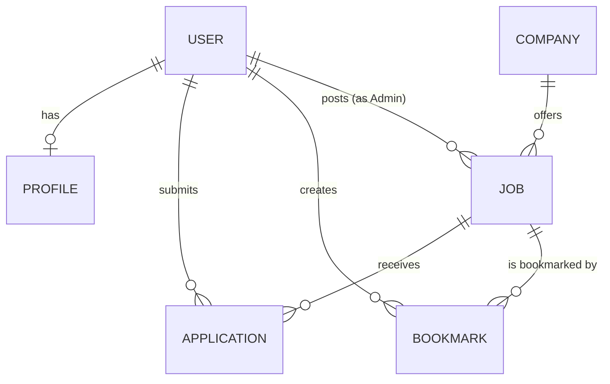

# HireHub Database Design & Schema (Prisma ORM & PostgreSQL)

This document outlines the database design for the **HireHub** job board application. It uses **PostgreSQL** as the primary relational database and **Prisma ORM** for schema declaration and migration management.

---

## 1. Entity Relationship Diagram (ERD) Overview

The schema is built around five core domains:
- **Authentication & Profiles**: `User` and `Profile` tables.
- **Companies**: `Company` table representing employers.
- **Jobs**: `Job` listings posted by Admins and linked to Companies.
- **Applications**: `Application` mappings linking candidates to job listings.
- **Engagement**: `Bookmark` and `NewsletterSubscription` tables.



---

## 2. Prisma ORM Schema Definition

Create this file as `prisma/schema.prisma` in your Express project.

```prisma
datasource db {
  provider = "postgresql"
  url      = env("DATABASE_URL")
}

generator client {
  provider = "prisma-client-js"
}

// ==========================================
// ENUMS
// ==========================================

enum Role {
  CANDIDATE
  ADMIN
}

enum JobType {
  FULL_TIME
  PART_TIME
  CONTRACT
  INTERNSHIP
}

enum RemoteOption {
  REMOTE
  HYBRID
  ON_SITE
}

enum JobStatus {
  ACTIVE
  DRAFT
  CLOSED
}

enum ApplicationStatus {
  PENDING
  REVIEWED
  ACCEPTED
  REJECTED
}

// ==========================================
// MODELS
// ==========================================

model User {
  id           String        @id @default(uuid())
  email        String        @unique
  passwordHash String
  name         String
  role         Role          @default(CANDIDATE)
  createdAt    DateTime      @default(now())
  updatedAt    DateTime      @updatedAt
  
  // Relations
  profile      Profile?
  applications Application[]
  postedJobs   Job[]         @relation("AdminJobs")
  bookmarks    Bookmark[]

  @@index([email])
}

model Profile {
  id                String   @id @default(uuid())
  userId            String   @unique
  phone             String?
  resumeUrl         String?
  skills            String[] // Stored as text[] array in PostgreSQL
  experienceLevel   String?  // e.g. "Fresher", "1-3 Years", etc.
  currentSalary     String?  // e.g. "₹12 - 18 LPA"
  preferredLocation String?  // e.g. "Bangalore, India"
  jobType           String?  // Preferred type e.g., "Full Time"
  isRemoteOnly      Boolean  @default(false)
  createdAt         DateTime @default(now())
  updatedAt         DateTime @updatedAt
  
  // Relations
  user              User     @relation(fields: [userId], references: [id], onDelete: Cascade)
}

model Company {
  id             String   @id @default(uuid())
  name           String   @unique
  initial        String   @db.VarChar(2) // Company initial for profile display (e.g. "G" for Google)
  color          String   // Tailwind background gradient classes (e.g. "from-blue-500 to-red-500")
  industry       String   @default("Technology")
  size           String   @default("10,000+")
  website        String   @default("company.com")
  createdAt      DateTime @default(now())
  updatedAt      DateTime @updatedAt

  // Relations
  jobs           Job[]
}

model Job {
  id               String       @id @default(uuid())
  title            String
  companyId        String
  location         String
  experience       String       // e.g. "3-5 Years"
  salary           String       // e.g. "₹20 - 30 LPA"
  type             JobType
  remote           RemoteOption
  skills           String[]     // Stored as text[] array in PostgreSQL for tag filtering
  category         String       // e.g. "Frontend", "Backend"
  description      String       @db.Text
  requirements     String[]     // List of requirements (stored as text[])
  responsibilities String[]     // List of responsibilities (stored as text[])
  benefits         String[]     // List of benefits (stored as text[])
  status           JobStatus    @default(DRAFT)
  featured         Boolean      @default(false)
  postedById       String
  createdAt        DateTime     @default(now())
  updatedAt        DateTime     @updatedAt

  // Relations
  company          Company      @relation(fields: [companyId], references: [id], onDelete: Restrict)
  postedBy         User         @relation("AdminJobs", fields: [postedById], references: [id], onDelete: Cascade)
  applications     Application[]
  bookmarks        Bookmark[]

  @@index([status, category])
  @@index([title])
}

model Application {
  id           String            @id @default(uuid())
  jobId        String
  candidateId  String
  name         String            // Candidate name (historical snapshot)
  email        String            // Candidate email (historical snapshot)
  phone        String
  resumeUrl    String            // Link to S3/Cloud Storage stored CV
  coverLetter  String?           @db.Text
  status       ApplicationStatus @default(PENDING)
  createdAt    DateTime          @default(now())
  updatedAt    DateTime          @updatedAt

  // Relations
  job          Job               @relation(fields: [jobId], references: [id], onDelete: Cascade)
  candidate    User              @relation(fields: [candidateId], references: [id], onDelete: Cascade)

  // A user can apply only once per job listing
  @@unique([jobId, candidateId])
  @@index([status])
}

model Bookmark {
  id          String   @id @default(uuid())
  userId      String
  jobId       String
  createdAt   DateTime @default(now())

  // Relations
  user        User     @relation(fields: [userId], references: [id], onDelete: Cascade)
  job         Job      @relation(fields: [jobId], references: [id], onDelete: Cascade)

  @@unique([userId, jobId])
}

model NewsletterSubscription {
  id        String   @id @default(uuid())
  email     String   @unique
  createdAt DateTime @default(now())
  
  @@index([email])
}
```

---

## 3. PostgreSQL Specific Optimizations & Migration Notes

1. **Array Columns**: Columns declared with `String[]` (such as `Job.skills`, `Job.requirements`, etc.) map directly to PostgreSQL's native `text[]` column type. This allows index searches using PG Array operators (like `@>` - contains).
2. **Indexing Strategy**:
   - `User(email)` and `NewsletterSubscription(email)` are indexed with `@@unique` constraints, creating B-Tree indexes by default for rapid lookups during authentication/subscriptions.
   - `Job(status, category)` combined index speeds up frontend searches on `/jobs` which filter by active status and category.
   - `Job(title)` is indexed for job search functionality.
   - `Application(status)` is indexed for fast admin dashboard reads.
3. **Cascading Deletes**:
   - Deleting a `User` cascades to delete their candidate `Profile`, `Application` records, and `Bookmark` records.
   - Deleting a `Job` cascades to delete related `Application` and `Bookmark` items, but `Company` cannot be deleted if active jobs exist (`onDelete: Restrict`).
